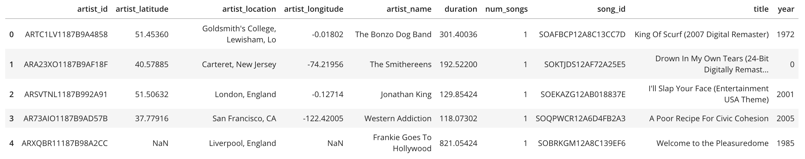
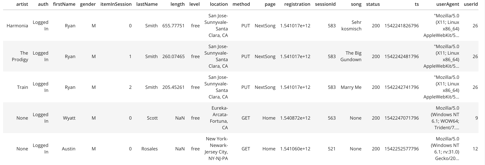

**Project Three: Data Lake with S3 and Spark**

 

**Overview**

This Project Builds a Data Lake ETL Pipeline using Spark and S3 for a music streaming company called sparkify.

**Technologies used**

*   Spark -
    *   Used for extracting, transforming, loading, and running test queries
*   Python 
    *   Boto3 - Amazon SDK
        *   Used to create IAM Role, EMR Cluster, and Connect to S3 
*   AWS EMR
    *   Used to Run Spark Job on large datasets
*   S3 
    *   Storage service that holds log and song data JSON files
    *   Storage for Dimension and Fact table Parquet Files

**How to Run**

*   AWS
    *   Create Spark Role
        *   Used to Create IAM Role, EMR Cluster
    *   Create an IAM user 
        *   With permissions to use EMR and S3
*   Fill in the dl.cfg with your info
    *   Key, Secret, File Paths
*   Run etl.py
    *   Uses Spark to extracts Data from input song and log data S3 paths
    *   Transform the Data
    *   Loads Table Parquet Files into output data S3 Path
*   S3_And_Queries.ipynb
    *   Jupyter Notebook used to run test queries

**Information About Dataset**

*   s3://udacity-dend/song_data
    *   14897 JSON files
*   **Song_Data Example**

*   s3://udacity-dend/log_data
    *   31 JSON files
*   **Log_Data Example**

**Queries Examples from Test_Queries.ipynb**

1. Give me the Total Count of each table.

*   **Query:** 

                SELECT  (
                SELECT COUNT(*)
                FROM   song_table
                ) AS song_table_count,
                (
                SELECT COUNT(*)
                FROM   artist_table
                ) AS artist_table_count,
                (
                SELECT COUNT(*)
                FROM user_table
                ) AS user_table_count,
                (
                SELECT COUNT(*)
                FROM   time_table
                ) AS time_table_count,
                (
                SELECT COUNT(*)
                FROM songplay_table
                ) AS songplay_table_count

           

*   **Query:**

               Select t.weekday, count(s.songplay_id) as number_of_listens_each_day
               From time t
               JOIN songplay s  on (t.start_time = s.start_time)
               Group by t.weekday
               Order by number_of_listens_each_day DESC;

